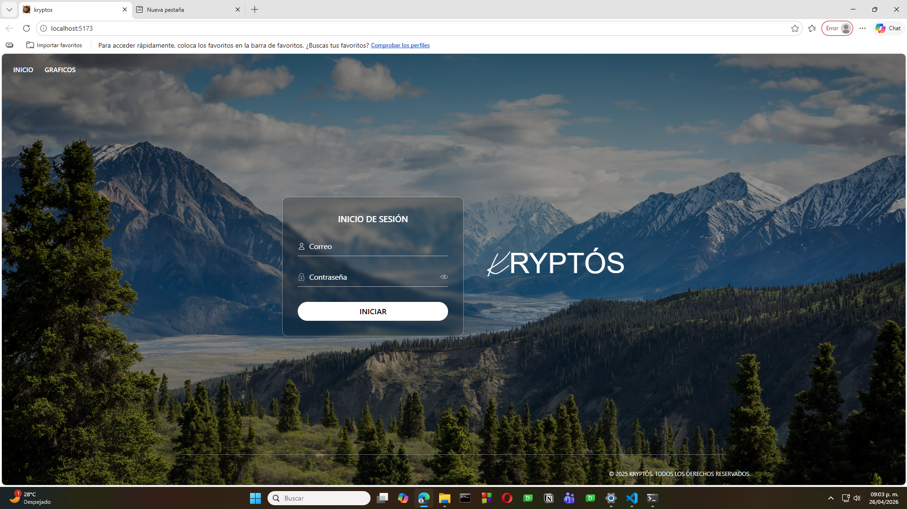
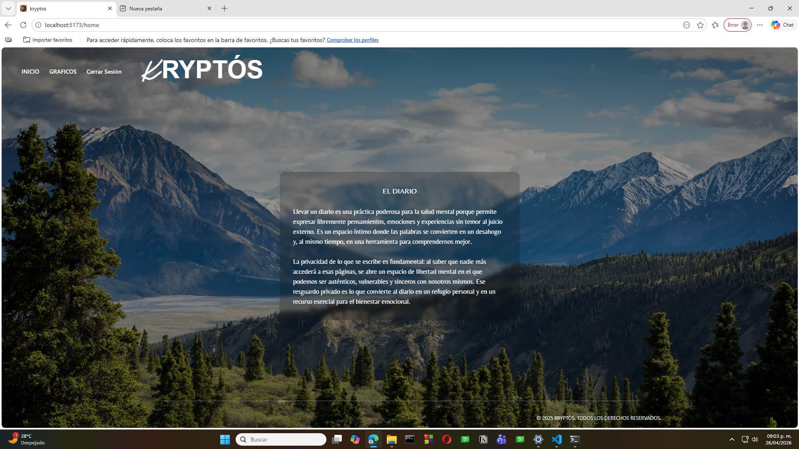
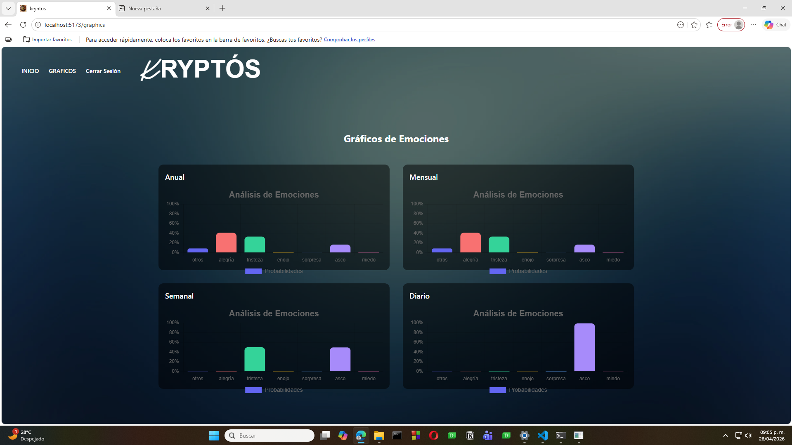

# 🖥️ KRYPTOS Frontend

Frontend desarrollado con **React.js** para la visualización en tiempo real del análisis emocional generado por la aplicación de escritorio de KRYPTOS.

---

## 📌 Descripción

KRYPTOS Frontend permite al usuario visualizar de forma clara e intuitiva los resultados obtenidos por el sistema de análisis emocional. La aplicación consume los datos proporcionados por el backend mediante una API REST y recibe actualizaciones en tiempo real utilizando WebSockets.

---

## ✨ Características

- 📊 Dashboard interactivo
- 📈 Gráficas emocionales
- ⚡ Actualización en tiempo real
- 🔐 Autenticación mediante JWT
- 📱 Diseño responsivo

---

## 🛠️ Tecnologías

- React.js
- Tailwind
- React Router Dom
- WebSockets

---

## 📸 Capturas

### Inicio de sesión



---

### Página principal



---

### Estadísticas



---

## 🚀 Instalación

```bash
git clone https://github.com/DanielC027/modular-pagina-web.git

cd modular-pagina-web

npm install

npm run dev
```

---

## 📚 Proyecto relacionado

Este repositorio forma parte del proyecto **KRYPTOS** junto con:

- modular-escritorio
- modular-backend

---

## 👨‍💻 Autor

**Daniel Canela**

Universidad de Guadalajara